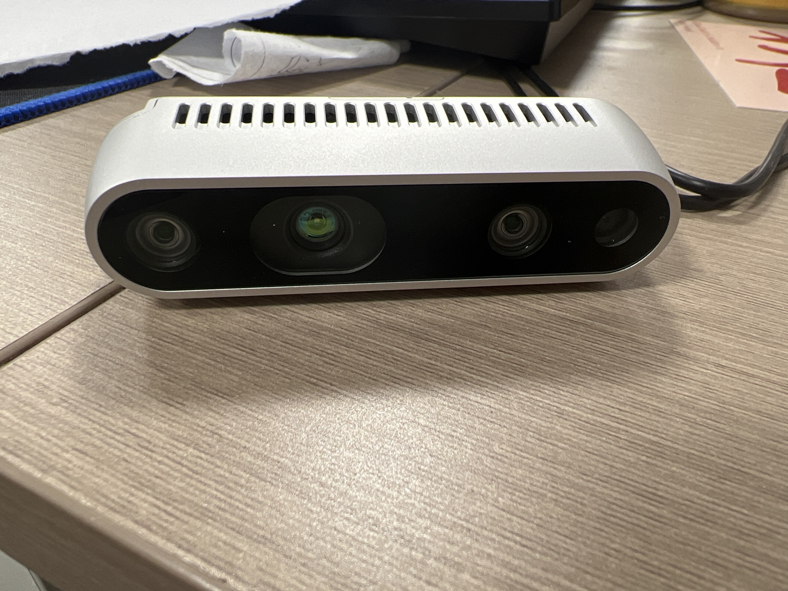
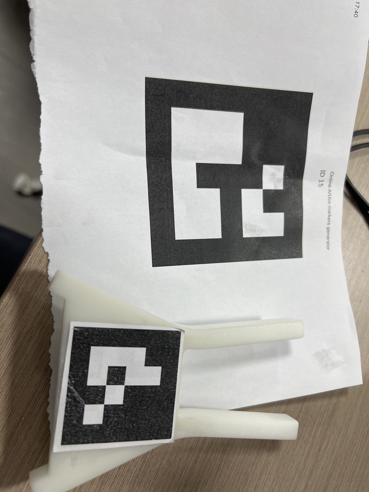
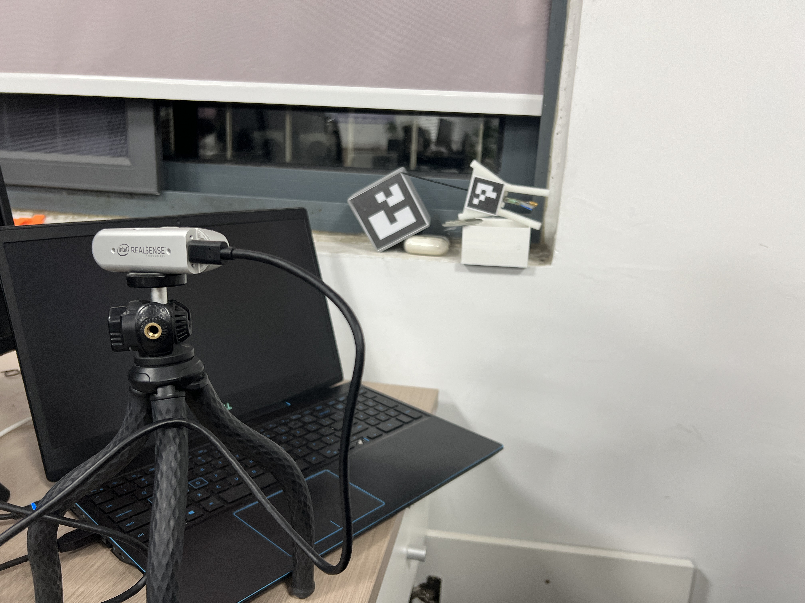
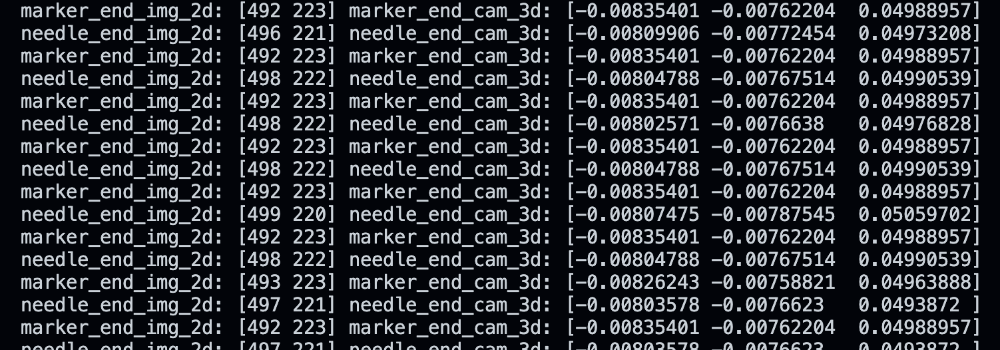

# Optic_Guide_System

## 使用指南

### 硬件

intelrealsense d435相机

4\*4和5\*5marker各一个

### 软件

测试环境为ubuntu22.04

python环境详见[environment.yml](./environment.yml)

## 功能简述

1. 使用intel realsense系列相机，识别Marker，分别完成相机对5\*5、4\*4Marker的相对位姿解算
2. 完成距离测算
3. 可行性验证

## 测试

1. 固定4*4marker与needle之间相对位置，使用needle末端在真实坐标系下与5*5marker角点接触。

通过实时解算的旋转平移矩阵计算needle末端点和5*5marker角点的二维与三维坐标，若结果正确，则两点坐标应相同.解算结果如下：

## TODO

1. 添加卡尔曼滤波增强稳定性
2. 添加bag文件读取功能

## install

conda create -n ogs python=3.10

conda activate ogs
